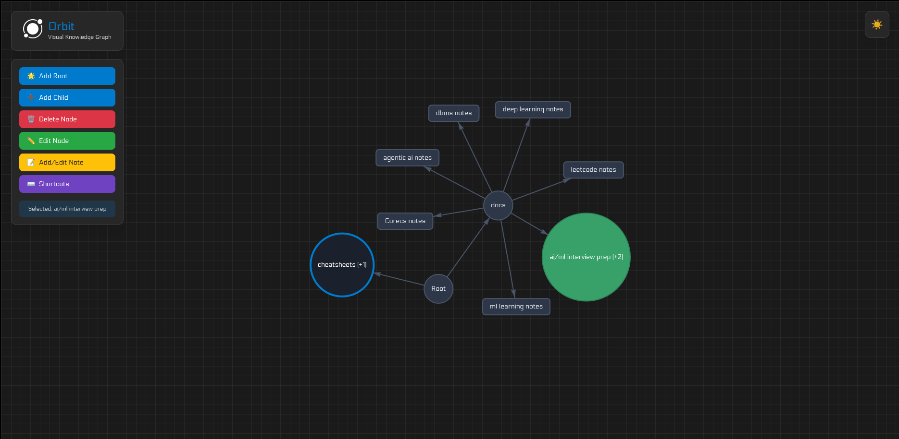
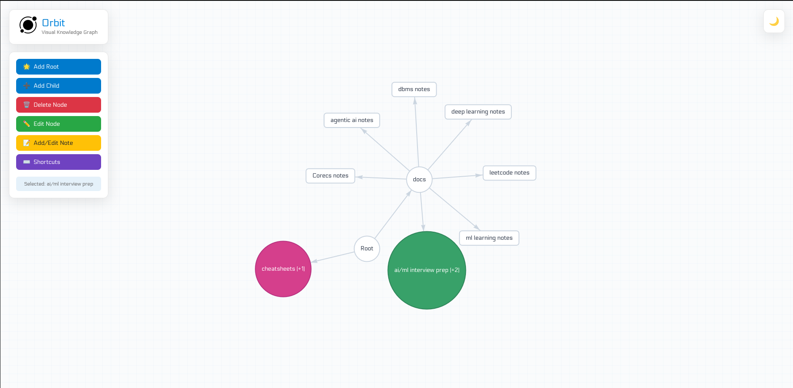
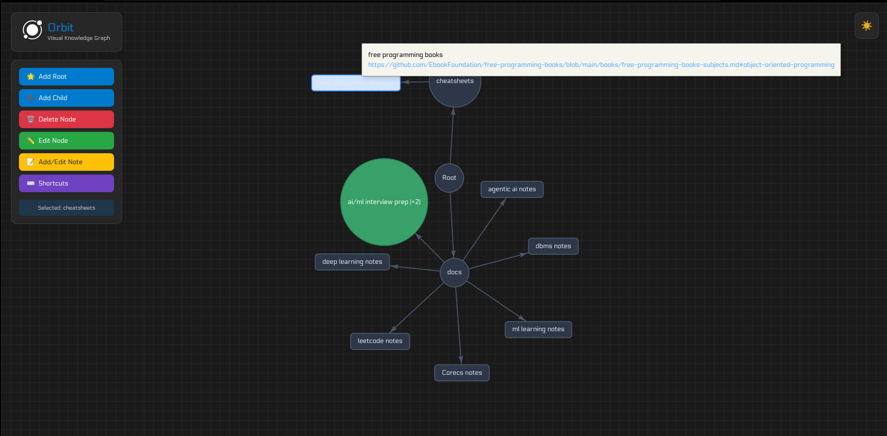

# Orbit Tab Tracker

**Description:** Orbit is a fancy tab tracking application I made as an experiment. I made this since whenever I was using the browser especially for learning something I would open a lot of tabs related to the topic so I decided why not make a bookmarking application that follows that principle. Inside each node you can add the browser link and a note related to it. While hovering on it you will be able to see the link and the note attached

Here is an image to show you how it would look in practise


Here is the light mode for this


Here is the hover feature to show how it would look like


## Features

- **Keyboard First:** Mostly everything in this application can be done via keyboard except for selecting nodes for that you would have to select with the mouse pointer. If anyone reading this has any tips on how I can include that please do contact me or make this an issue

- **Supabase sync:** If you want you can keep this project completely offline by just using localstorage to persist the data and use it on different browsers, sign in and your data will be stored in supabase

- **Fuzzy Search:** The coolest feature for any project is a fuzzy search just press windows + k and it will open the search interface for you.

- **Clustering:** If the graph gets messy just double click on the parent node to hide children node double click it again to expand it.

## Installation

To use it just follow the link here: https://orbit-tab-tracker.vercel.app/

To download and modify this

**Step1:** Copy paste this go to the directory created

```bash
git clone https://github.com/14-Hari-14/Orbit-Tab-Tracker.git
```

**Step 2:** Inside the directory do this

```bash
npm install
```

**Step 3:** start the dev server

```bash
npm run dev
```

## Contribution

1. **Fork the repository**

```bash
git clone https://github.com/14-Hari-14/Orbit-Tab-Tracker.git
cd orbit-tab-tracker
```

2. **Set up development environment**

```bash
npm install
npm run dev
```

3. **Create a feature branch**

```bash
git checkout -b feature/your-feature-name
```

4. **Make your changes**

   - Follow existing code style
   - Add comments for complex logic
   - Update documentation if needed

5. **Test your changes**

   - Test keyboard shortcuts
   - Test different themes
   - Test offline functionality
   - Test with different data sizes

6. **Commit and push**

```bash
git add .
git commit -m "feat: add your feature description"
git push origin feature/your-feature-name
```

7. **Create a Pull Request**
   - Clear title and description
   - Reference related issues
   - Include screenshots/GIFs for UI changes

## Credits

I would like to thank myself for creating this app instead of using some alternative people far smarter than me created

## License TLDR

This project is provided for free, non-commercial use.  
Feel free to explore, modify, and share it just don’t sell it or host it as a paid service.  
If you’d like to use it commercially, please reach out first.

## License

This will feel cheeky but I want this to be free of use and something that shouldnt be modified for profit so here is the license I drafted with the help of AI

Please refer to **[License](./LICENSE)**

For commercial licensing, contact: me my email is in my profile readme

Thank you for checking out this project, if you like it you may leave a star :)
